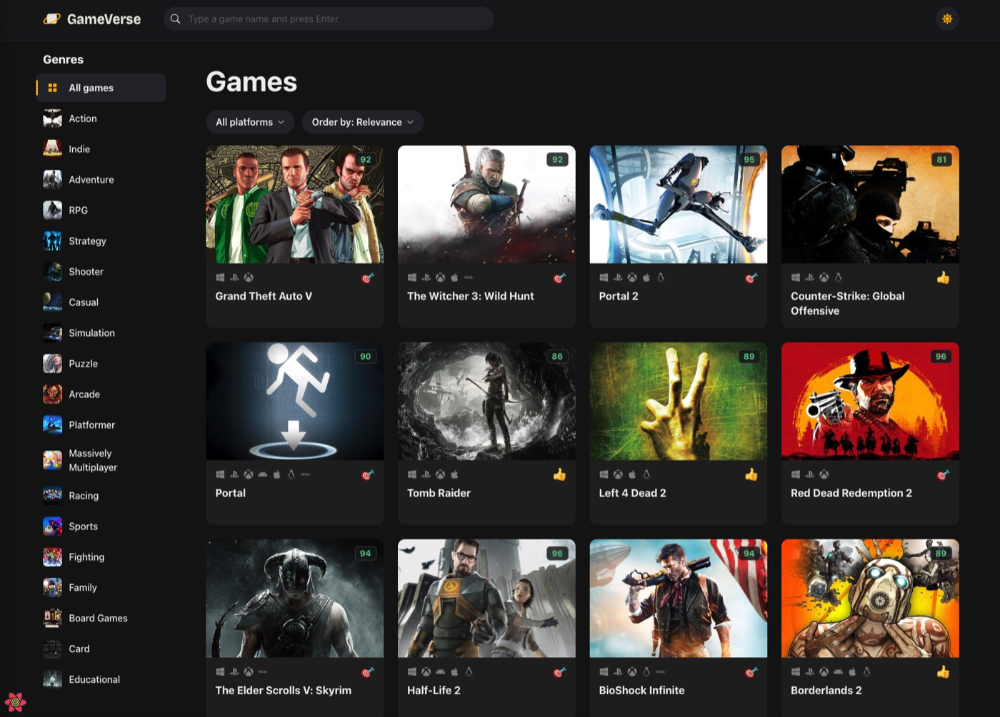
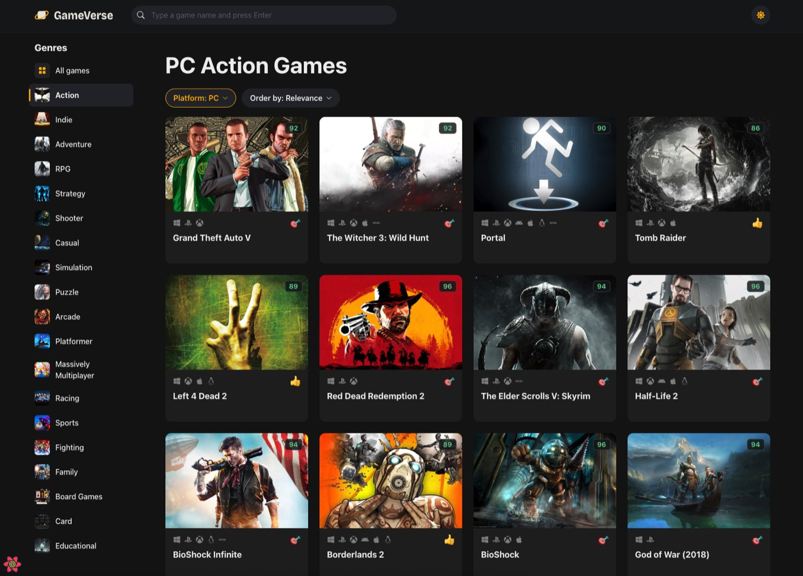
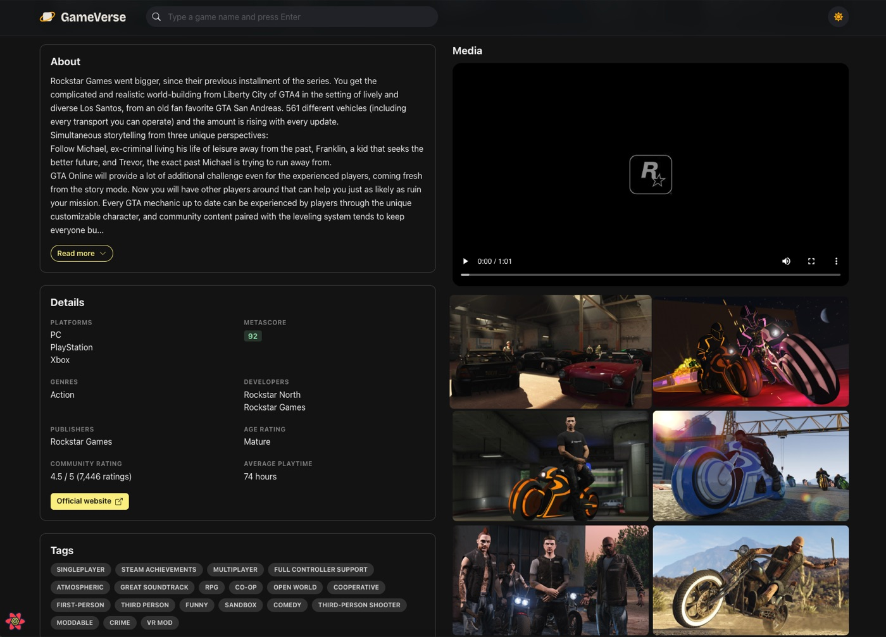
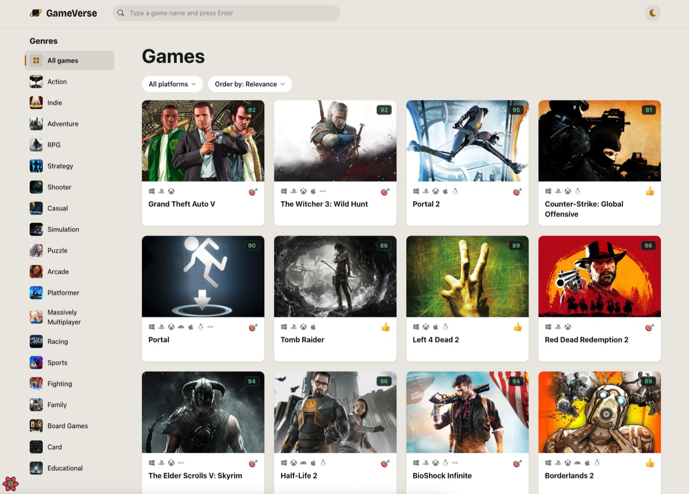
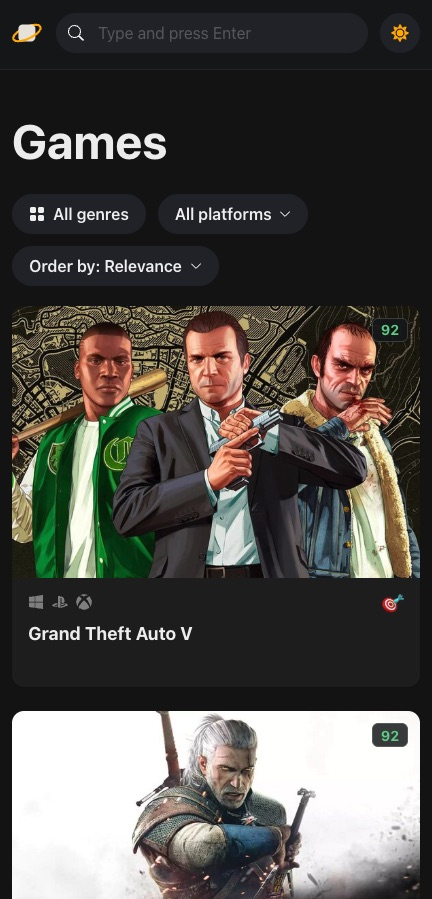

<div align="center">

# GameVerse

**A game discovery app built with React, TypeScript, and React Query. Browse, search, and filter thousands of games with a modern, responsive UI.**

[Live Demo](https://gameverse.shahzadtariq.com/) · [Report a Bug](https://github.com/Shaz-gill/gameverse/issues) · [Request a Feature](https://github.com/Shaz-gill/gameverse/issues)




</div>

---

## Table of Contents

- [Overview](#overview)
- [Screenshots](#screenshots)
- [Features](#features)
- [Tech Stack](#tech-stack)
- [Architecture](#architecture)
- [Infrastructure and Deployment](#infrastructure-and-deployment)
- [Getting Started](#getting-started)
- [Available Scripts](#available-scripts)
- [Project Structure](#project-structure)
- [Security Considerations](#security-considerations)
- [Roadmap](#roadmap)
- [Author](#author)
- [Acknowledgements](#acknowledgements)

---

## Overview

GameVerse lets users browse, search, and filter thousands of video games using data from the [RAWG.io API](https://rawg.io/apidocs), one of the largest gaming databases available. Each game has a dedicated detail page with a description, attributes, trailers, screenshots, and store links.

The project demonstrates a production-style frontend architecture: server state is managed by TanStack React Query, client state by Zustand, and the interface is built with Chakra UI for an accessible, responsive experience with light and dark modes. It is deployed to AWS with an automated CI/CD pipeline.

> **Project status:** This repository contains the **frontend**. An AWS serverless backend is in progress and will live in a separate repository.

---

## Screenshots

### Home


### Filtering and Sorting



### Game Details


### Trailers, Screenshots and Stores



### Dark and Light Mode



### Mobile



---

## Features

- **Game Discovery**: Browse a large catalog as a responsive card grid with platform icons and critic scores.
- **Filtering**: Narrow results by genre and platform. Filters apply immediately and are reflected in the page heading.
- **Search**: Search the full catalog by title.
- **Sorting**: Order results by relevance, date added, name, release date, popularity, or average rating.
- **Infinite Scrolling**: More games load as you scroll, with skeleton cards shown while the next page loads.
- **Game Detail Pages**: Dedicated routes (`/games/:slug`) with an expandable description, attributes, tags, trailers, screenshots, and store links.
- **Light and Dark Mode**: Built-in color mode switch, dark by default.
- **Responsive Design**: Works on mobile, tablet, and desktop, with a genre drawer on smaller screens.
- **Loading, Empty and Error States**: Skeleton placeholders, a friendly "no results" message with a reset action, a retry button on failed requests, and a dedicated error page for invalid routes.
- **Efficient Data Fetching**: Caching, background refetching, and request deduplication through React Query.

---

## Tech Stack

| Layer             | Technology                          |
| ----------------- | ----------------------------------- |
| UI Framework      | React 18                            |
| Language          | TypeScript 4.9                      |
| Build Tool        | Vite 4                              |
| Component Library | Chakra UI 2                         |
| Server State      | TanStack React Query 4              |
| Client State      | Zustand 4                           |
| Routing           | React Router DOM 6                  |
| HTTP Client       | Axios                               |
| Data Source       | RAWG.io REST API                    |
| Hosting           | AWS S3, CloudFront and Route 53     |
| CI/CD             | GitHub Actions                      |

---

## Architecture

```
  Filter components ──write──▶ Zustand store (gameQuery)
                                      │
                                      ▼ read
                          useGames (useInfiniteQuery)
                          key: ["games", gameQuery]
                                      │
                                      ▼
                          APIClient<T> (Axios instance)
                                      │
                                      ▼
                                 RAWG.io API
```

- **Single source of truth for filters**: the Zustand store holds one `gameQuery` object (genre, platform, sort order, search text).
- **Query-driven refetching**: `gameQuery` is part of the React Query key, so any filter change triggers a fetch and each combination is cached independently.
- **Generic API client**: a typed `APIClient<T>` class wraps a shared Axios instance. Each resource hook (games, genres, platforms, screenshots, trailers, stores) creates a client for its endpoint.
- **Typed entities**: RAWG response shapes are defined in `src/entities/` and used as generics across the client and hooks.
- **Routing**: `Layout` is the parent route, with `HomePage` as the index and `GameDetailPage` at `games/:slug`. `ErrorPage` handles routing errors.

---

## Infrastructure and Deployment

This repository is the frontend. It is built into static files and hosted on AWS, with GitHub Actions deploying every push to `master`. An AWS serverless backend is in progress in a separate repository.

### How it all fits together

```
Visitor → gameverse.shahzadtariq.com
            │
            ▼
      Route 53 (DNS)          "Where is this website?"
            │  A record (Alias)
            ▼
      CloudFront (CDN)        HTTPS, caching, copies near every visitor (US, AU, etc.)
            │  private access (OAC)
            ▼
      S3 bucket               Stores the built files (index.html, assets/)

GitHub push → GitHub Actions → build → upload to S3 → clear CloudFront cache
```

| Component      | Role                                                                 |
| -------------- | -------------------------------------------------------------------- |
| Route 53       | DNS: points the custom domain to CloudFront                          |
| CloudFront     | CDN: serves the site over HTTPS from locations close to the visitor  |
| S3 (private)   | Stores the built files, readable only by CloudFront through OAC      |
| GitHub Actions | Builds the app, syncs `dist/` to S3, and invalidates the CDN cache   |

The workflow lives in [`.github/workflows/deploy.yml`](.github/workflows/deploy.yml) and signs in to AWS through an IAM role, so no long-lived AWS keys are stored in GitHub.

---

## Getting Started

Follow these steps to run GameVerse locally.

### Prerequisites

| Requirement  | Version       | Check with       |
| ------------ | ------------- | ---------------- |
| Node.js      | 16 or higher  | `node --version` |
| npm          | 8 or higher   | `npm --version`  |
| Git          | Any recent    | `git --version`  |
| RAWG API key | Free account  | See step 3       |

### Step 1: Clone the repository

```sh
git clone https://github.com/Shaz-gill/gameverse.git
cd gameverse
```

### Step 2: Install dependencies

```sh
npm install
```

### Step 3: Get a RAWG API key

1. Create a free account at [rawg.io/apidocs](https://rawg.io/apidocs).
2. Copy your API key from the dashboard.

### Step 4: Add the API key

Open `src/services/api-clients.ts` and replace the value of `key`:

```ts
const axiosInstance = axios.create({
  baseURL: "https://api.rawg.io/api/",
  params: {
    key: "your_api_key_here",
  },
});
```

> The key is currently set in source, so do not commit your own key to a public repository. See [Security Considerations](#security-considerations).

### Step 5: Start the development server

```sh
npm run dev
```

Open [http://localhost:5173](http://localhost:5173). The page reloads automatically when you edit files.

### Step 6: Verify the setup

- The home page shows a grid of game cards.
- Selecting a genre or platform updates the grid.
- Clicking a card opens its detail page.

If the grid shows a "Couldn't load games" message, check that your API key is valid and that you are online.

### Troubleshooting

| Problem                      | Fix                                                                   |
| ---------------------------- | --------------------------------------------------------------------- |
| `npm install` fails          | Confirm Node.js is 16 or higher, then delete `node_modules` and retry |
| Port 5173 already in use     | Stop the other process, or run `npm run dev -- --port 3000`           |
| "Couldn't load games" error  | Check the API key in `src/services/api-clients.ts` and your network   |
| Build fails with type errors | Run `npm run build` and fix the errors `tsc` reports                  |

---

## Available Scripts

| Command           | Description                                      |
| ----------------- | ------------------------------------------------ |
| `npm run dev`     | Start the Vite development server                |
| `npm run build`   | Type-check with `tsc`, then build into `dist/`   |
| `npm run preview` | Serve the production build locally               |

---

## Project Structure

```
src/
├── assets/           # Static assets (icons, images)
├── components/       # Reusable UI components
├── entities/         # TypeScript types for RAWG API responses
├── hooks/            # React Query hooks, one per resource
├── pages/            # Route-level pages (Home, GameDetail, Error, Layout)
├── services/         # Axios instance and generic APIClient
├── routes.tsx        # Router configuration
├── store.ts          # Zustand store for game query state
├── theme.ts          # Chakra UI theme and color mode config
└── main.tsx          # Application entry point and providers
```

---

## Security Considerations

The RAWG API key is currently included in the client bundle, so it is visible to anyone using the live site. This is acceptable for a demo project but is not suitable for production. The serverless backend that is in progress is intended to fix this by:

- Proxying all RAWG requests through a backend, so the browser never sees the key.
- Storing the API key as a server-side secret.
- Adding rate limiting and request validation on the server layer.

---

## Roadmap

- [x] Responsive UI with light and dark mode
- [x] Infinite scrolling with skeleton loading
- [x] Game detail pages with trailers, screenshots, and store links
- [x] Hosting on AWS (S3, CloudFront, Route 53) with automated CI/CD
- [ ] AWS serverless backend in a separate repository, to keep the API key server-side
- [ ] Automated tests and a linter
- [ ] Keep filters in the URL so filtered views can be shared

---

## Author

**Shahzad Tariq**

- GitHub: [@Shaz-gill](https://github.com/Shaz-gill)
- Live project: [gameverse.shahzadtariq.com](https://gameverse.shahzadtariq.com/)

---

## Acknowledgements

- [RAWG.io](https://rawg.io/apidocs) for the game data API
- [Chakra UI](https://chakra-ui.com/), [TanStack Query](https://tanstack.com/query), and [Zustand](https://github.com/pmndrs/zustand) for the tooling that powers the app
