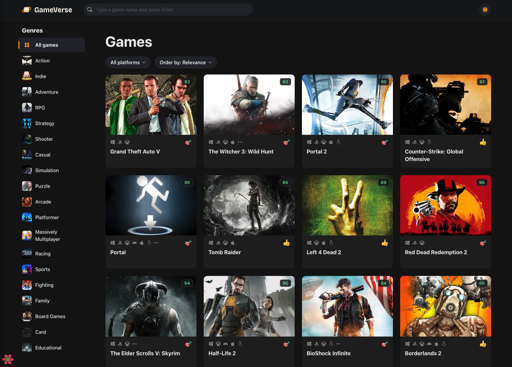
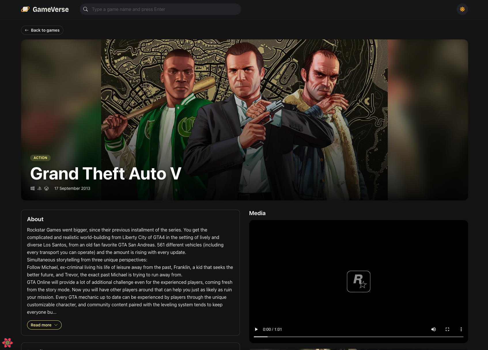
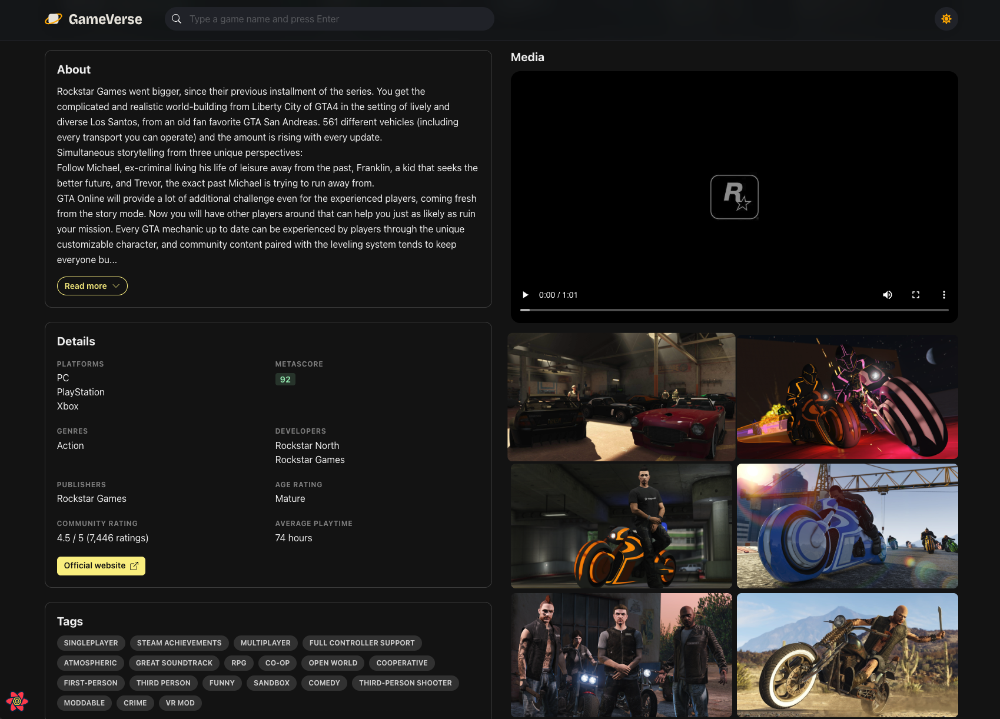
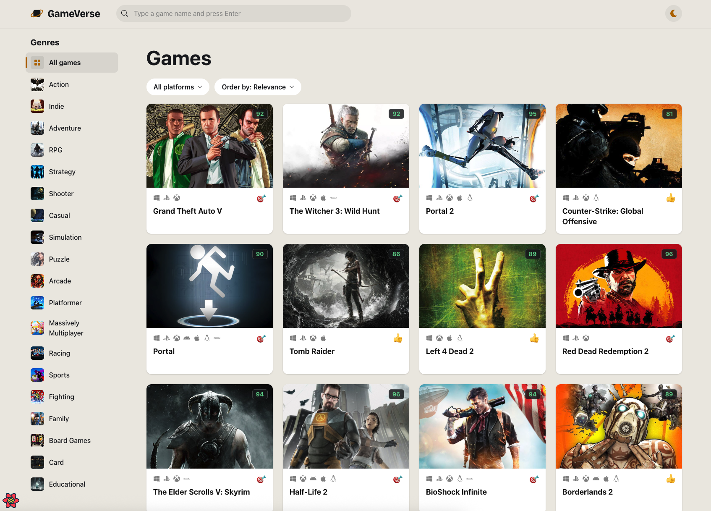
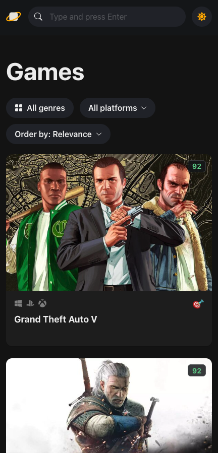

<div align="center">

# Game Verse

**Game Verse is a game discovery app using React, TypeScript, and React Query. It lets users browse, search, and filter games with a modern UI and external API integration.**

[Report a Bug](https://github.com/Shaz-gill/react-typescript-game-verse/issues) · [Request a Feature](https://github.com/Shaz-gill/react-typescript-game-verse/issues)


</div>

---

## Table of Contents

- [Overview](#overview)
- [Screenshots](#screenshots)
- [Features](#features)
- [Tech Stack](#tech-stack)
- [Architecture](#architecture)
- [Getting Started](#getting-started)
- [Available Scripts](#available-scripts)
- [Project Structure](#project-structure)
- [Security Considerations](#security-considerations)
- [Roadmap](#roadmap)
- [Acknowledgements](#acknowledgements)

---

## Overview

Game Verse lets users browse, search, and filter thousands of video games using data from the [RAWG.io API](https://rawg.io/apidocs), one of the largest gaming databases available. Each game has a dedicated detail page with descriptions, attributes, trailers, screenshots, and store links.

The project demonstrates a production-style frontend architecture: server state is managed by TanStack React Query, client state by Zustand, and the interface is built with Chakra UI for an accessible, responsive experience with light and dark modes.

---

## Screenshots

### Home Page

<!-- Add screenshot: home page with game grid -->


### Filtering and Sorting

<!-- Add screenshot: genre list, platform dropdown, and sort selector in use -->


### Game Detail Page

<!-- Add screenshot: detail page with description and attributes -->


### Trailers, Screenshots and Stores

<!-- Add screenshot: media and store sections of the detail page -->


### Dark and Light Mode

<!-- Add screenshot: side-by-side of both color modes -->


### Mobile View

<!-- Add screenshot: responsive layout on a phone viewport -->


---

## Features

- **Game Discovery**: Browse a large catalog of games as a responsive card grid, with platform icons and critic scores.
- **Filtering**: Narrow results by genre and platform. Filters apply immediately and are reflected in the page heading.
- **Search**: Search the full catalog by title.
- **Sorting**: Order results by relevance, date added, name, release date, popularity, or average rating.
- **Infinite Scrolling**: Additional results load progressively as the user scrolls, following RAWG's pagination.
- **Game Detail Pages**: Dedicated routes (`/games/:slug`) with an expandable description, game attributes, trailers, screenshots, and store links.
- **Light and Dark Mode**: Built-in color mode switch.
- **Responsive Design**: Optimized for mobile, tablet, and desktop, including a genre drawer on smaller screens.
- **Loading and Error States**: Skeleton placeholders while loading and a dedicated error page for invalid routes.
- **Efficient Data Fetching**: Automatic caching, background refetching, and request deduplication through React Query.

---

## Tech Stack

| Layer             | Technology           | Version |
| ----------------- | -------------------- | ------- |
| UI Framework      | React                | 18      |
| Language          | TypeScript           | 4.9     |
| Build Tool        | Vite                 | 4       |
| Component Library | Chakra UI            | 2       |
| Server State      | TanStack React Query | 4       |
| Client State      | Zustand              | 4       |
| Animations        | Framer Motion        | 12      |
| Routing           | React Router DOM     | 6       |
| HTTP Client       | Axios                | 1       |
| Data Source       | RAWG.io REST API     | n/a     |

---

## Architecture

```
  Filter components ──write──▶ Zustand store (gameQuery)
                                      │
                                      ▼ read
                          useGames (useInfiniteQuery)
                          key: ["games", gameQuery]
                                      │
                                      ▼
                          APIClient<T> (Axios instance)
                                      │
                                      ▼
                                 RAWG.io API
```

- **Single source of truth for filters**: the Zustand store holds one `gameQuery` object (genre, platform, sort order, search text).
- **Query-driven refetching**: `gameQuery` is part of the React Query key, so any filter change triggers a fetch and each combination is cached independently.
- **Generic API client**: a typed `APIClient<T>` class wraps a shared Axios instance. Each resource hook (games, genres, platforms, screenshots, trailers, stores) creates a client for its endpoint.
- **Typed entities**: RAWG response shapes are defined in `src/entities/` and used as generics across the client and hooks.
- **Routing**: `Layout` is the parent route, with `HomePage` as the index and `GameDetailPage` at `games/:slug`. `ErrorPage` handles routing errors.

---

## Getting Started

Follow these steps to run Game Verse on your machine.

### Prerequisites

| Requirement | Version        | Check with       |
| ----------- | -------------- | ---------------- |
| Node.js     | 16 or higher   | `node --version` |
| npm         | 8 or higher    | `npm --version`  |
| Git         | Any recent     | `git --version`  |
| RAWG API key | Free account  | See step 3       |

### Step 1: Clone the repository

```sh
git clone https://github.com/Shaz-gill/react-typescript-game-verse.git
cd react-typescript-game-verse
```

### Step 2: Install dependencies

```sh
npm install
```

### Step 3: Get a RAWG API key

1. Create a free account at [rawg.io/apidocs](https://rawg.io/apidocs).
2. Copy your API key from the dashboard.

### Step 4: Add the API key

Open `src/services/api-clients.ts` and replace the value of `key`:

```ts
const axiosInstance = axios.create({
  baseURL: "https://api.rawg.io/api/",
  params: {
    key: "your_api_key_here",
  },
});
```

> The key is currently set in source rather than read from an environment variable, so do not commit your own key to a public repository. See [Security Considerations](#security-considerations) and the [Roadmap](#roadmap).

### Step 5: Start the development server

```sh
npm run dev
```

Open [http://localhost:5173](http://localhost:5173). The page reloads automatically when you edit files.

### Step 6: Verify the setup

- The home page shows a grid of game cards.
- Selecting a genre or platform updates the grid.
- Clicking a card opens its detail page.

If the grid shows a "Couldn't load games" message, check that your API key is valid and that you are online.

### Build for production

```sh
npm run build     # type-check with tsc, then build into dist/
npm run preview   # serve the production build locally
```

The output in `dist/` can be served by any static hosting provider.

### Troubleshooting

| Problem                          | Fix                                                                 |
| -------------------------------- | ------------------------------------------------------------------- |
| `npm install` fails              | Confirm Node.js is 16 or higher, then delete `node_modules` and retry |
| Port 5173 already in use         | Stop the other process, or run `npm run dev -- --port 3000`         |
| "Couldn't load games" error      | Check the API key in `src/services/api-clients.ts` and your network |
| Build fails with type errors     | Run `npm run build` and fix the errors `tsc` reports                |

---

## Available Scripts

| Command           | Description                                          |
| ----------------- | ---------------------------------------------------- |
| `npm run dev`     | Start the Vite development server                    |
| `npm run build`   | Type-check with `tsc`, then build for production     |
| `npm run preview` | Serve the production build locally                   |

---

## Project Structure

```
src/
├── assets/           # Static assets (icons, images)
├── components/       # Reusable UI components
├── entities/         # TypeScript types for RAWG API responses
├── hooks/            # React Query hooks, one per resource
├── pages/            # Route-level pages (Home, GameDetail, Error, Layout)
├── services/         # Axios instance and generic APIClient
├── routes.tsx        # Router configuration
├── store.ts          # Zustand store for game query state
├── theme.ts          # Chakra UI theme and color mode config
└── main.tsx          # Application entry point and providers
```

---

## Security Considerations

The RAWG API key is currently included in the client bundle. This is acceptable for a demo project but is not suitable for production. For a production deployment:

- Proxy all RAWG requests through a backend service or serverless function.
- Store the API key as a server-side environment variable, never exposing it to the client.
- Add rate limiting and request validation on the server layer.

---

## Roadmap

- [ ] Load the API key from a `VITE_RAWG_API_KEY` environment variable
- [ ] Debounce search input to reduce API calls
- [ ] Add automated tests and linting
- [ ] Add a backend proxy for API requests

---

## Acknowledgements

- [RAWG.io](https://rawg.io/apidocs) for the game data API
- [Chakra UI](https://chakra-ui.com/), [TanStack Query](https://tanstack.com/query), and [Zustand](https://github.com/pmndrs/zustand) for the tooling that powers the app
